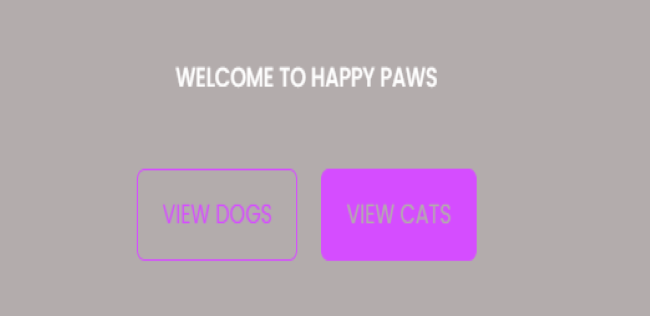

# vroom-vroom

## Decription
# Happy Paws is an animal shelter website with the ability to create an account to put a pet up for adoption that was found on the road or newborn kittens and puppies that your pet had.

## User Story
# When the user lands on the homepage you are presented with a polished and interactive user interface.
# The user is then prompted to select between dogs and cats to pick from
# Once the user makes their choice they are presented with a card page listing all the dogs/ cats on the submitted thru an interactive form.
# Once an animal is selected the user is then able to apply to adopt the animal and gain +1 furry friend.

## Technologies used
# React
# Apollo
# MongoDB

## How to use
1. Go to the following Heroku link https://guarded-cove-87598.herokuapp.com/
2. Sign up and log in
3. Browse pets in the dog or cat page.
4. Add any lost dogs or cats that you find using the lost pet buttons.
5. Browse the dog or cat page to verify that your pet has been added.

## Installation Instructions
1. Clone the repo.
2. Run npm install at the root folder of this project
3. Run npm start.
6. Once you've started the server, access the app at http://localhost:3001

# Screenshot of app

# Link to deployed heroku app
# https://guarded-cove-87598.herokuapp.com/

## Credits
# Kate Lam GitHub: Kate-github
# Luis Garcia GitHub: garcia2697
# Valerie Gleason GitHub: hellovolcano

